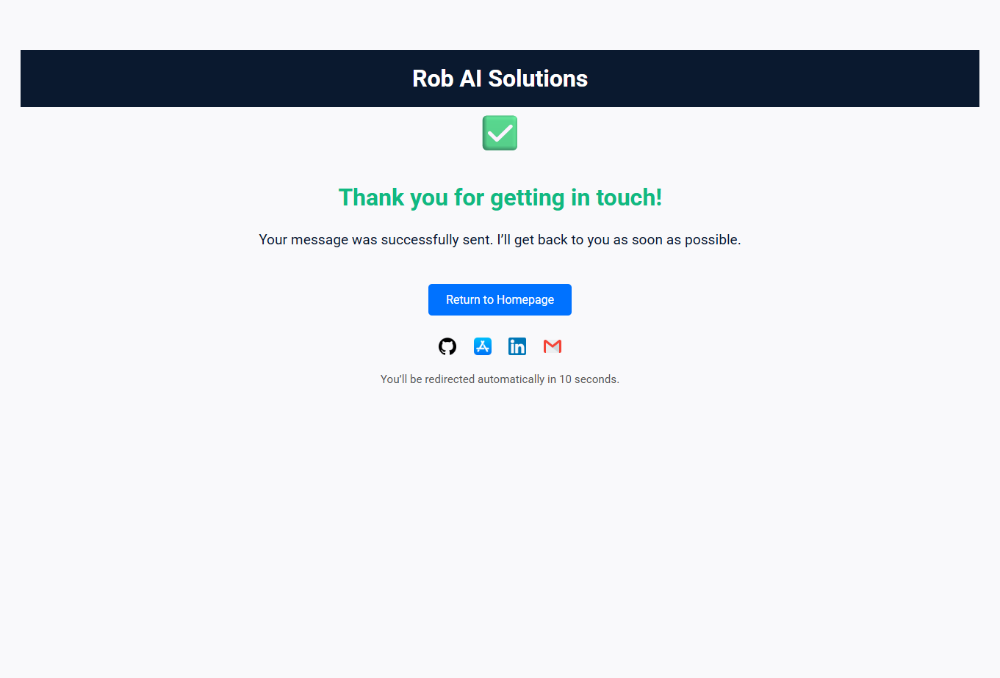

# AI-Powered Client Report Generator – Rob AI Solutions

An AI-driven web app that collects user input and delivers personalized client reports. Built with Streamlit and deployed via GitHub Pages.

---

## ✨ Features

- 📩 User-friendly contact and intake form  
- ✅ Custom success/thank-you page with auto-redirect  
- 🔗 Integrated with Formspree for email delivery  
- 📊 GA4 tracking for analytics  
- 🖼️ Mobile-optimized and branded UI  

---

## 🔧 Tech Stack

- **Streamlit**
- **GitHub Pages**
- **Formspree**
- **HTML5 + CSS3**
- **Google Analytics (GA4)**

---

## 🔗 Live Demo

👉 [https://rbaseman2.github.io/ai-report-generator/thanks.html](https://rbaseman2.github.io/ai-report-generator/thanks.html)

---

## 💰 Business Value

This thank-you page is more than just a form confirmation — it's part of a fully automated lead intake system for Rob AI Solutions.

✅ Replaces costly CRM or intake tools like Typeform, Mailchimp, or HubSpot — saving ~$300/month  
✅ Enables scalable client capture with zero backend hosting costs  
✅ Integrated analytics provide insights into user intent and conversion  

It’s a practical example of how I build lean, branded automation for small businesses looking to scale with AI.

---

## 📬 Contact

- 🌐 [robaisolutions.com](https://robaisolutions.com)
- 💼 [GitHub](https://github.com/rbaseman2)
- 🔗 [LinkedIn](https://linkedin.com/in/robaisolutions)
